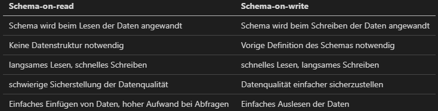

# Was ist JSON?
JSON steht für *Java Script Object Notation* und ist ein Format zu Datenspeicherung, das auf den Datentypen der Programmiersprache JavaScript basiert, die im Namen enthalten ist. Aufgrund der Tatsache, dass JSON sowohl von Maschinen als auch Menschen gut verstanden werden kann, ist JSON in der heutigen Zeit weit verbreitet. Insbesondere in der Web-Entwicklung wird JSON oft eingesetzt, um Informationen über das Internet auszutauschen. (Felipe Pezoa)
Auch bei der Datenspeicherung wird das JSON-Format aufgrund seiner flexiblen Struktur eingesetzt. 

# Struktur
An einem Beispiel soll die Struktur eines JSON-Objekts erklärt werden.
```
{
  "mitarbeiter": {
    "vorname": "Max",
    "nachname": "Mustermann",
    "qualifikationen": [
      "Data Warehouse",
      "Sicherheit"
    ]
  }
}
```
*Mitarbeiter* ist ein Objekt. *vorname* und *nachname* sind beides Schlüssel (Keys), denen ein bestimmer Wert zugewiesen wird (Value). *Qualifikationen* ist ein Array, in dem mehrere Werte, oder auch wieder verschachtelte Objekte abgelegt werden können.


# Nutzen
Warum will man überhaupt JSON-Daten in relationalen Datenbanken speichern?

In relationalen Datenbankmanagementsystemen muss vor der Speicherung von Daten das Datenbankschema vorgegeben werden. Damit wird festgelegt, wie viele Spalten in den Tabellen zur Verfügung stehen sollen und welche Datentypen darin gespeichert werden.
Dieses traditionelle Konzepz der relationen DBMS, das in den letzten 25 Jahren sehr weit verbreitet war, ist heutzutage nicht mehr für alle Anforderungen sinnvoll, weshalb immer mehr andere DBMS eingesetzt werden (Stonebrakerm, Cetintemel).
"One size does not fit all" (#3, S. 25 Buckenhofer)

Dokumentenorientierte Datenbankmanagementsysteme unterstützen als beispielhafte Vertreter der No-SQL-Datenbanken JSON nativ und profitieren von der flexiblen Speicherung von Daten. HIer spricht man auch von *Schema-on-read*, das die Speicherung von Daten ermöglicht, ohne vorher ein Schema festgelegt zu haben. 

Relationale DBMS speichern die Daten traditionell in vordefinierten Strukturen ab (Craug Chasseur). Hier spricht man auch von *Schema-on-write*.

Die Unterschiede können folgendermaßen zusammgefasst werden (Buckenhofer, (TABELLE aus Vorlesung #3, S 51)):

| Schema-on-read                                           | Schema-on-write                                |
| -------------------------------------------------------- | ---------------------------------------------- |
| Schema wird beim Lesen der Daten angewandt               | Schema wird beim Schreiben der Daten angewandt |
| Keine Datenstruktur notwendig                            | Vorige Definition des Schemas notwendig        |
| langsames Lesen, schnelles Schreiben                     | schnelles Lesen, langsames Schreiben           |
| schwierige Sicherstellung der Datenqualität              | Datenqualität einfacher sicherzustellen        |
| Einfaches Einfügen von Daten, hoher Aufwand bei Abfragen | Einfaches Auslesen der Daten                   |




Viele moderne relationale Datenbankmanagementsysteme unterstützen mittlerweile aber auch das Speichern von Daten im JSON-Format und ermöglichen dadurch die Mischung von strukturierten und unstrukturierten Daten. (Liu et al)

PostgreSQL, das hier als Beispiel verwendet wird, unterstützt dies seit Version 9.2. In Version 9.3 wurde die Funktionsweise nochmal weiterentwickelt. (Petkovic) 